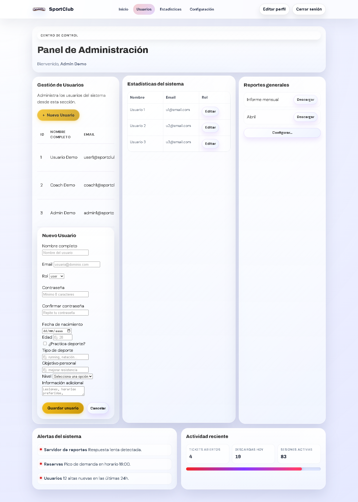

# Evidencia de entrega - SportClub FrontEnd con API

Fecha de verificacion: 13/05/2026  
Repositorio GitHub: https://github.com/Felipe2076/Unidad-1-front-end-Javier-Haumada  
Rama de trabajo: `desarrollo`

## Contexto

La aplicacion SportClub fue revisada con backend activo en `http://localhost:3000`, ejecutado desde `backend` con `npm start`.

Usuarios demo utilizados para validacion:

- Admin demo
- Coach demo
- Usuario demo

## Evidencias en vivo

Captura generada desde Brave:



Resultado de prueba de fuego:

```json
{
  "api": {
    "health": "ok",
    "adminRole": "admin",
    "usersBefore": 3,
    "exposesPassword": false,
    "createdUserId": 4,
    "updatedName": "Usuario Evidencia Editado",
    "userProfileEmail": "evidencia.1778686636918@sportclub.cl",
    "profileUpdatedName": "Usuario Evidencia Perfil",
    "passwordChange": "Contraseña actualizada correctamente.",
    "reloginRole": "user",
    "badLogin": "Credenciales incorrectas.",
    "invalidRole": "El rol enviado no es válido.",
    "usersAfter": 3,
    "cleanupOk": true
  },
  "browser": {
    "browser": "Brave",
    "url": "http://localhost:3000/dashboard_admin.html",
    "adminName": "Admin Demo",
    "tableRows": 3,
    "screenshot": "docs/evidencias/prueba-login-brave.png"
  }
}
```

## Requerimientos validados

- Login correcto con consumo de `POST /api/auth/login`.
- Redireccion por rol hacia dashboard de administrador.
- CRUD de usuarios funcionando para rol `admin`.
- Perfil de usuario consultado y actualizado con token.
- Cambio de contraseña validado con minimo de 8 caracteres y confirmacion.
- Errores mostrados sin `alert`.
- Tabla de usuarios no expone `password` ni `passwordHash`.

## Revision de seguridad aplicada

- Las contraseñas fueron migradas desde texto plano a hash PBKDF2 SHA-256.
- Los tokens de sesion ahora tienen expiracion.
- Se agrego limite basico de intentos fallidos de login.
- Se valido que los roles permitidos sean solo `user`, `coach` y `admin`.
- Se limito el tamano del JSON recibido por la API.
- Se agregaron cabeceras HTTP basicas de seguridad.
- Se escaparon datos renderizados en la tabla de administrador para reducir riesgo de XSS.

## Comandos de verificacion

```bash
node --check backend/server.js
npm audit --audit-level=moderate
```

Resultados:

- Sintaxis del backend: OK.
- Vulnerabilidades npm: `found 0 vulnerabilities`.
